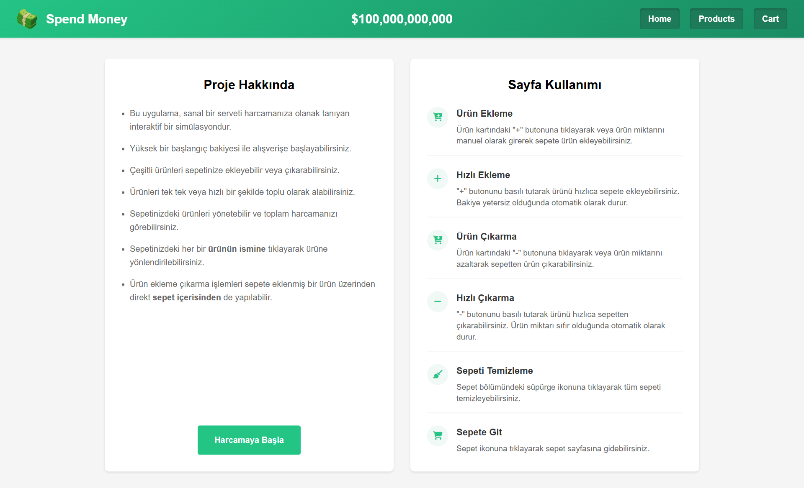

# 💰 Bill Gates Money | React + Vite

Bill Gates'in parasını harcayabileceğiniz interaktif bir alışveriş simülasyonu uygulamasıdır. React ve Vite kullanılarak geliştirilmiştir.
* Bu proje, Patika Frontend Bootcamp'i için oluşturulan **Hafta-10 / React - Bill Gates Money** projesidir.
* Modern ve responsive bir alışveriş simülasyonu uygulamasıdır.
* **React**, **Vite**, **CSS3** ve **JavaScript** kullanılmıştır.
* Context API ve React Hooks ile state yönetimi sağlanmıştır.

---

## :computer: Kullanım

1. Projeyi klonlayın
```bash
git clone https://github.com/tunahanyasar/Spend-Billgates-Money.git
```

2. Proje klasörüne gidin
```bash
cd cd spend-bill-gates-money
```

3. Bağımlılıkları yükleyin
```bash
npm install
```

4. Geliştirme sunucusunu başlatın
```bash
npm run dev
```

---

## 📜 Proje Yapısı

:open_file_folder: **Klasörler;**
* *src/*
  * *components/*
    * *Cart.jsx*
    * *Header.jsx*
    * *ProductCard.jsx*
    * *ProductList.jsx*
  * *pages/*
    * *Home.jsx*
    * *Products.jsx*
    * *Cart.jsx*
  * *context/*
    * *MoneyContext.jsx*
  * *data/*
    * *products.js*
  * *assets/*
    *  *images/* 
    * *money-logo.png*
  * *App.jsx*
  * *App.css*
  * *main.jsx*
* *index.html*
* *package.json*

1. ***src/components/***: React bileşenleri bu klasörde bulunur.
    * **Cart.jsx**: Sepet içeriğini ve işlemlerini yöneten bileşen
    * **Header.jsx**: Uygulama başlığı ve navigasyon menüsünü içeren bileşen
    * **ProductCard.jsx**: Ürün kartı ve alım-satım işlemlerini içeren bileşen
    * **ProductList.jsx**: Ürün listesini ve sayfalama işlemlerini yöneten bileşen

2. ***src/pages/***: Sayfa bileşenleri
    * **Home.jsx**: Ana sayfa ve proje açıklaması
    * **Products.jsx**: Ürünler sayfası

3. ***src/context/***: Context API dosyaları
    * **MoneyContext.jsx**: Bakiye ve sepet yönetimi için context

4. ***src/data/***: Veri dosyaları
    * **products.js**: Ürün veritabanı

5. ***src/assets/***: Statik dosyalar
    * **money-logo.png**: Uygulama logosu

6. ***src/assets/images***: Ürünlerin resimleri

7. ***App.css***: Tüm CSS özellikleri

8. ***App.jsx***: Ana uygulama bileşeni ve routing yapısı
---

## :star2: Özellikler

1. **Alışveriş Özellikleri**
   - 100 milyar dolar başlangıç bakiyesi
   - Ürün satın alma ve satma
   - Sepete ekleme ve çıkarma
   - Sepeti temizleme
   - Basılı tutarak hızlı alım-satım yapabilme
   - Ürün ismine tıklayarak ürün sayfasına yönlendirme
   - Sepet içinde ürün silme butonu
   
2. **Modern UI/UX**
   - Kullanıcı dostu arayüz
   - Görsel geri bildirimler
   - Temiz ve düzenli kod yapısı
   - Animasyonlu geçişler
   - Para formatı dönüşümleri
   - Ürün kartı efektleri

---

## 🔄 Son Güncellemeler

1. **Sepet İyileştirmeleri**
   - Boş sepet durumunda placeholder gösterimi
   - Sepet içinde ürün silme butonu eklendi
   - Sepet içinde ürün ismine tıklayarak ürün sayfasına yönlendirme
   - Sepet içinde bakiye gösterimi

2. **Alışveriş Deneyimi İyileştirmeleri**
   - Basılı tutarak hızlı alım-satım yapabilme özelliği
   - Ürün kartı tasarımı optimize edildi
   - Görsel iyileştirmeler yapıldı

3. **Genel İyileştirmeler**
   - Context API ile state yönetimi optimize edildi
   - Sayfa kenar boşlukları düzenlendi
   - Görsel tutarlılık sağlandı
   - Kod yapısı temizlendi ve optimize edildi

## 💡 Kullanılan Yapılar | Kazanımlar

**React:**
* Component Mimarisi
* Props Sistemi
* Context API
* React Hooks (useState, useEffect, useRef)
* Event Handling
* Conditional Rendering
* React Router

**CSS:**
* Flexbox Layout
* CSS Grid
* CSS Animations
* Transform & Transitions
* Responsive Design
* Custom Properties
* Gradient Effects

**JavaScript:**
* ES6+ Özellikleri
* Array Metodları
* Zamanlayıcılar
* Event Handling
* State Management
* Context API Kullanımı

---

## :paperclip: Ekran Görüntüleri

### Ana Sayfa


### Ürünler Sayfası


### Sepet


---

## 🎮 Nasıl Kullanılır?

1. Ana sayfadan "Harcamaya Başla" butonuna tıklayın.
2. Ürünler sayfasında istediğiniz ürünleri sepete ekleyin:
   - "+" butonuna tıklayarak veya basılı tutarak ürün ekleyin
   - "-" butonuna tıklayarak veya basılı tutarak ürün çıkarın

3. Sepet içinde:
   - Ürün ismine tıklayarak ürün sayfasına gidebilirsiniz
   - Çöp kutusu ikonuna tıklayarak ürünü sepetten çıkarabilirsiniz
   - Süpürge ikonuna tıklayarak sepeti temizleyebilirsiniz
4. Bakiyeniz yetersiz olduğunda ürün satın alamazsınız.
5. Sepetteki ürünleri satarak bakiyenizi artırabilirsiniz.

---

## 🔍 Detaylı Açıklama

### Proje Amacı ve Kapsamı

Bu proje, Bill Gates'in servetini görselleştirmek ve kullanıcıların bu serveti nasıl harcayabileceklerini simüle etmek amacıyla geliştirilmiştir. Kullanıcılar, 100 milyar dolar başlangıç bakiyesiyle çeşitli ürünleri satın alabilir, satabilir ve sepetlerini yönetebilirler.

### Teknik Detaylar

#### App.jsx - Ana Uygulama Bileşeni

**App.jsx** dosyası, uygulamanın ana bileşenidir ve şu önemli işlevleri içerir:

1. **Context Provider Entegrasyonu**: 
   - `MoneyProvider` bileşeni ile tüm uygulamaya bakiye ve sepet yönetimi sağlanır
   - Bu sayede her bileşen ayrı ayrı prop drilling yapmak zorunda kalmaz

2. **Routing Yapısı**:
   - React Router kullanılarak sayfa yönlendirmeleri yapılır
   - Ana sayfa (`/`), ürünler sayfası (`/products/:page`) ve sepet sayfası (`/cart`) route'ları tanımlanmıştır
   - URL parametreleri ile sayfalama işlemi desteklenir

3. **Layout Yapısı**:
   - Ürünler ve sepet bileşenleri yan yana yerleştirilmiştir
   - CSS Grid kullanılarak responsive bir düzen sağlanmıştır

4. **Font Awesome Entegrasyonu**:
   - `useEffect` hook'u ile Font Awesome ikonları dinamik olarak yüklenir
   - Cleanup fonksiyonu ile bellek sızıntıları önlenir

5. **Alt Bileşenler**:
   - `MoneyDisplay`: Bakiye gösterimi için özel bileşen
   - `ProductsPageWrapper`: Ürünler sayfası için URL parametrelerini işleyen wrapper bileşen


#### Kullanıcı Deneyimi İyileştirmeleri
- **Basılı Tutma Özelliği**: Alım-satım butonlarında basılı tutma özelliği eklenerek kullanıcıların hızlı işlem yapabilmesi sağlanmıştır.
- **Görsel Geri Bildirimler**: Butonlara tıklandığında, ürün eklendiğinde veya çıkarıldığında görsel geri bildirimler sağlanarak kullanıcı deneyimi iyileştirilmiştir.

#### Responsive Tasarım
- **CSS Grid ve Flexbox**: Sayfa düzeni için CSS Grid ve Flexbox kullanılarak farklı ekran boyutlarına uyumlu bir tasarım elde edilmiştir.
- **Media Queries**: Farklı ekran boyutları için özel stil tanımlamaları yapılarak mobil cihazlarda da sorunsuz çalışması sağlanmıştır.


### Gelecek Geliştirmeler

- **Yerel Depolama**: Sepet ve bakiye bilgilerinin tarayıcı yerel depolamasında saklanması
- **Kategori Filtreleme**: Ürünlerin kategorilere göre filtrelenmesi
- **Arama Özelliği**: Ürünlerde arama yapabilme
- **Favori Ürünler**: Favori ürünleri kaydetme ve hızlı erişim
- **İstatistikler**: Harcama istatistikleri ve grafikler

---

## 👤 İletişim

Tunahan Yasar - [GitHub](https://github.com/tunahanyasar)

Proje Linki: [https://github.com/tunahanyasar/billgates-money]
