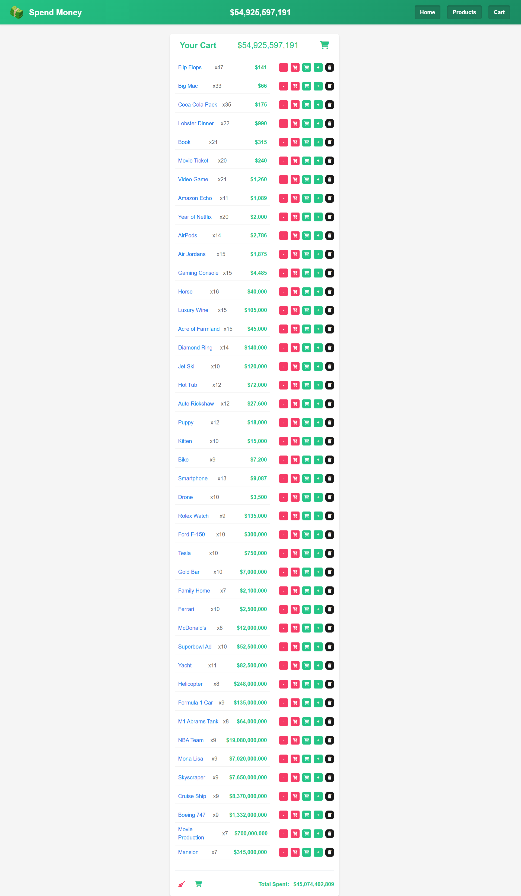

# 💰 Spend Money | React + Vite

[🇹🇷 Click for Turkish README](./README.tr.md)

*Created on: April 17, 2025*

* An interactive shopping simulation where you can spend virtual wealth. Built with React and Vite.
* This project was created for Patika Frontend Bootcamp **Week-10 / Assignment-1 | React Spend Money**.
* Modern and responsive shopping simulation application.
* Built with **React**, **Vite**, **CSS3**, and **JavaScript**.
* State management provided with Context API and React Hooks.

---
## 🌐 Live Demo

Visit the live site: [Spend Money | React](https://spend-money-app-reactjs.vercel.app/)

---

## :computer: Installation & Usage

1. Clone the repository:
```bash
git clone https://github.com/tunahanyasar/spend-money-app-reactjs.git
```

2. Navigate to the project folder:
```bash
cd spend-money-app-reactjs
```

3. Install dependencies:
```bash
npm install
```
```bash
npm install react-router-dom
```

4. Start the development server:
```bash
npm run dev
```

5. Open in your browser: [http://localhost:5173](http://localhost:5173)

---
## 🎮 How to Use?

1. **Start Shopping**: Click the "Start Spending" button from the home page to begin your shopping experience.

2. **Add Products to Cart**: On the products page, add your desired items to the cart:
   - Click the **"+"** button or **hold it down** to quickly add multiple products
   - Click the **"-"** button or **hold it down** to quickly remove products
   - Watch your balance update in real-time as you add or remove items

3. **Manage Your Cart**: 
   - **View Products**: Click on any product name in the cart to navigate to its detailed page
   - **Remove Items**: Click the **trash icon** to remove a specific product from your cart
   - **Clear Cart**: Click the **broom icon** to completely clear your entire cart
   - **Monitor Balance**: Your current balance is displayed at the top of the page

4. **Shopping Rules**:
   - **Insufficient Funds**: You cannot purchase products when your balance is insufficient
   - **Selling Products**: You can increase your balance by selling products back from your cart
   - **Real-time Updates**: All transactions update your balance and cart instantly

5. **Navigation**:
   - Use the navigation menu to switch between Home, Products, and Cart pages
   - The current page is highlighted in the navigation
   - Your balance is always visible in the header for easy reference

---

## 📜 Project Structure

:open_file_folder: **Folders:**
* *src/*
  * *components/*
    * *Cart.jsx*
    * *Header.jsx*
    * *ProductCard.jsx*
    * *ProductList.jsx*
  * *pages/*
    * *Home.jsx*
    * *Products.jsx*
    * *Cart.jsx*
  * *context/*
    * *MoneyContext.jsx*
  * *data/*
    * *products.js*
  * *assets/*
    *  *screenshots/* 
   * *App.jsx*
   * *App.css*
   * *main.jsx*
* *public/*
   * images

* *index.html*
* *package.json*

1. ***src/components/***: React components are located here.
    * **Cart.jsx**: Component that manages cart content and operations
    * **Header.jsx**: Component containing application title and navigation menu
    * **ProductCard.jsx**: Component containing product card and buy/sell operations
    * **ProductList.jsx**: Component that manages product list and pagination operations

2. ***src/pages/***: Page components
    * **Home.jsx**: Home page and project description
    * **Products.jsx**: Products page

3. ***src/context/***: Context API files
    * **MoneyContext.jsx**: Context for balance and cart management

4. ***src/data/***: Data files
    * **products.js**: Product database

5. ***src/assets/screenshots***: Page outputs

6. ***public/images***: Product images and logo

7. ***App.css***: All CSS properties

8. ***App.jsx***: Main application component and routing structure
---

## :star2: Features

1. **Shopping Features**
   - 100 billion dollar starting balance
   - Product buying and selling
   - Adding and removing from cart
   - Clearing cart
   - Quick buy/sell by holding buttons
   - Clicking product name to navigate to product page
   - Product delete button within cart
   
2. **Modern UI/UX**
   - User-friendly interface
   - Visual feedback
   - Clean and organized code structure
   - Animated transitions
   - Currency format conversions
   - Product card effects

---

## 🔄 Recent Updates

1. **Cart Improvements**
   - Placeholder display for empty cart
   - Product delete button added within cart
   - Clicking product name in cart to navigate to product page
   - Balance display within cart

2. **Shopping Experience Improvements**
   - Quick buy/sell feature by holding buttons
   - Product card design optimized
   - Visual improvements made

3. **General Improvements**
   - State management optimized with Context API
   - Page margins adjusted
   - Visual consistency achieved
   - Code structure cleaned and optimized
---
## 💡 Technologies & Concepts

**React:**
* Component Architecture
* Props System
* Context API
* React Hooks (useState, useEffect, useRef)
* Event Handling
* Conditional Rendering
* React Router

**CSS:**
* Flexbox Layout
* CSS Grid
* CSS Animations
* Transform & Transitions
* Responsive Design
* Custom Properties
* Gradient Effects

**JavaScript:**
* ES6+ Features
* Array Methods
* Timers
* Event Handling
* State Management
* Context API Usage


---

## 🔍 Detailed Description

### Project Purpose and Scope

This project was developed to visualize virtual wealth and simulate how users can spend this wealth. Users can buy, sell, and manage their cart with various products using a 100 billion dollar starting balance.

### Technical Details

#### App.jsx - Main Application Component

**App.jsx** file is the main component of the application and contains the following important functions:

1. **Context Provider Integration**: 
   - Balance and cart management is provided to the entire application through `MoneyProvider` component
   - This way, each component doesn't have to do prop drilling separately

2. **Routing Structure**:
   - Page redirects are made using React Router
   - Home page (`/`), products page (`/products/:page`), and cart page (`/cart`) routes are defined
   - Pagination operation is supported with URL parameters

3. **Layout Structure**:
   - Products and cart components are placed side by side
   - Responsive layout is achieved using CSS Grid

4. **Font Awesome Integration**:
   - Font Awesome icons are loaded dynamically using `useEffect` hook
   - Memory leaks are prevented with cleanup function

5. **Sub Components**:
   - `MoneyDisplay`: Special component for balance display
   - `ProductsPageWrapper`: Wrapper component that processes URL parameters for products page

#### User Experience Improvements
- **Hold Feature**: Hold feature is added to buy/sell buttons to enable users to make quick transactions.
- **Visual Feedback**: Visual feedback is provided when buttons are clicked, products are added or removed, improving user experience.

#### Responsive Design
- **CSS Grid and Flexbox**: CSS Grid and Flexbox are used for page layout to achieve a design compatible with different screen sizes.
- **Media Queries**: Special style definitions are made for different screen sizes to ensure smooth operation on mobile devices as well.

### Future Developments

- **Local Storage**: Storing cart and balance information in browser local storage
- **Category Filtering**: Filtering products by categories
- **Search Feature**: Ability to search in products
- **Favorite Products**: Saving favorite products and quick access
- **Statistics**: Spending statistics and graphs

---

## :paperclip: Screenshots

### Home Page


### Products Page


### Cart


---

## 📞 Contact

[Tunahan Yaşar](https://github.com/tunahanyasar)

* GitHub: [@tunahanyasar](https://github.com/tunahanyasar)
* LinkedIn: [Tunahan Yaşar](https://www.linkedin.com/in/tunahan-yasar/) 